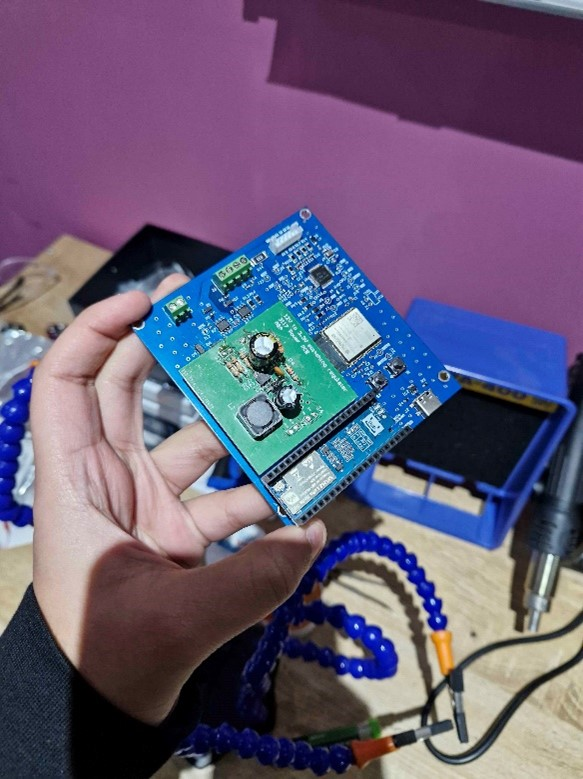
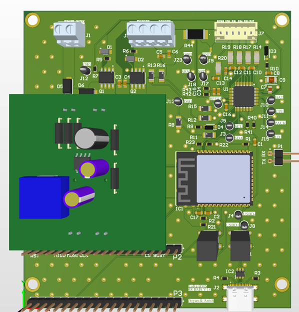
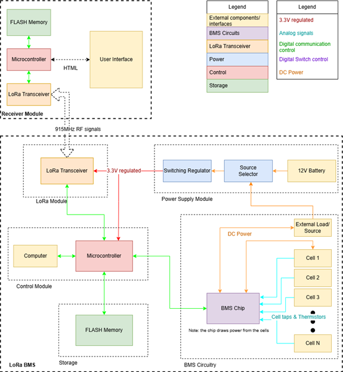

# LoRa-BMS

### Overview
The Long Range Battery Management System (LoRa BMS) is a proof of concept solution designed to address challenges in managing battery packs in rural and outdoor environments where Wi-Fi capability is limited. 

This project was designed and developed by:

- **Aryan Agarwal**
- **Anish Ghai**  

*Complete Board with Components*

*3D Render of the PCB*

### High Level Diagram

The prototype consists of a single 2-layer PCB that integrates power circuitry, battery management ICs, an ESP32 microcontroller, and an SX1262 module for LoRa communication. It is designed to manage lithium-ion, Li-polymer, and LiFePO4 battery cells efficiently.

---
### Features

- **Battery Management:**  
  Utilizes the Texas Instruments **BQ76942** IC for precise monitoring and protection of battery cells.
  
- **Microcontroller Integration:**  
  An **ESP32** microcontroller handles the system’s logic and communication protocols.

- **Long-Range Communication:**  
  Incorporates the **SX1262 LoRa module** for reliable wireless communication over extended distances.

- **Flexible Communication Interfaces:**  
  - **I2C:** Communication between the ESP32 and BQ76942 IC.  
  - **SPI:** Communication between the ESP32 and SX1262 module.

### Benefits

- Designed for **outdoor use** in rural areas with limited network infrastructure.
- Compatible with various **battery chemistries**: Lithium-Ion, Li-Polymer, and LiFePO4.
- Simplified architecture enables **cost-effective** implementation and scalability.

---

### Usage

1. **Hardware Setup:**
   - Connect the battery pack to the board as per the wiring diagram (refer to the project documentation).
   - Ensure the board is powered using the recommended voltage range.

2. **Software Configuration:**
   - Flash the ESP32 microcontroller with the provided firmware.
   - Adjust communication settings for the LoRa module as needed.

3. **Monitoring:**
   - Access the user interface to monitor battery parameters like cell voltage and temperature in real time.

---

### Contact

For any questions or support, please reach out.
